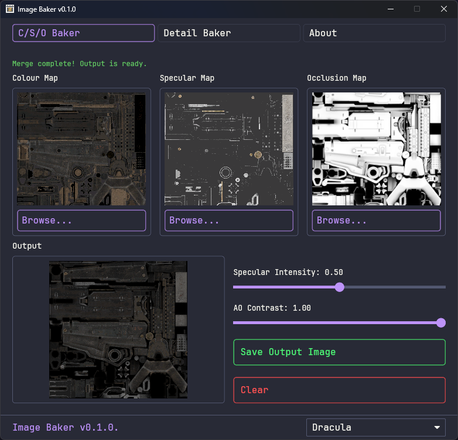

# Image Baker

A tool for merging texture maps (colour, specular, and occlusion) into a single baked output texture, and for baking detail maps into colour maps.

Built with Rust and [Iced](https://github.com/iced-rs/iced)



## Features

- **Browse Button Interface**: Click Browse buttons to select texture maps for each slot
- **Real-time Preview**: See input textures and merged output in real-time
- **Customizable Settings**: Adjust AO contrast and specular intensity with sliders

## Supported Texture Maps

The application automatically detects texture types based on filename suffixes:

- `*_c.*`, `*_col.*`, `*_color.*` - Colour/Diffuse map
- `*_s.*`, `*_spec.*`, `*_specular.*`, `*_spc.*` - Specular map
- `*_o.*`, `*_occ.*`, `*_occlusion.*` - Occlusion/AO map
- `*_d.*`, `*_detail.*` - Detail map

## How to Use

1. **Launch the application**
2. **Load your texture files** using the Browse buttons:
   - Click "Browse..." under Colour Map or drag and drop a file to load your colour/diffuse texture (required)
   - Click "Browse..." under Specular Map or drag and drop a file to load your specular texture (optional)
   - Click "Browse..." under Occlusion Map or drag and drop a file to load your AO texture (optional)
3. **Watch the merged output** appear automatically after loading the colour map
4. **Save the merged output**:
   - Click "Save Merged Image" button
   - Choose destination and save as PNG

**Note**: The colour map is required to start merging. Specular and occlusion maps are optional - if not provided, the merge will use default values (white/no effect).

## Building from Source

### Requirements

- Rust 1.88 or higher
- Windows (tested), Linux, or macOS

### Build Instructions

```bash
# Clone the repository
git clone https://github.com/echo000/image_baker
cd image_merge

# Build in release mode
cargo build --release

# Run the application
cargo run --release
```

The compiled binary will be in `target/release/image_baker.exe` (Windows)

## Configuration

Settings are automatically saved to:

| OS      | Path                                          |
|---------|-----------------------------------------------|
| Windows | `%appdata%\ImageBaker\config\settings.dat`           |

## Available Themes
There are multiple themes to select from, each with a unique colour palette.

## Credits

- **GUI Framework**: [Iced](https://github.com/iced-rs/iced)
- **File Dialogs**: [rfd](https://github.com/PolyMeilex/rfd)

## Contributing

Contributions are welcome! Please feel free to submit a Pull Request.
