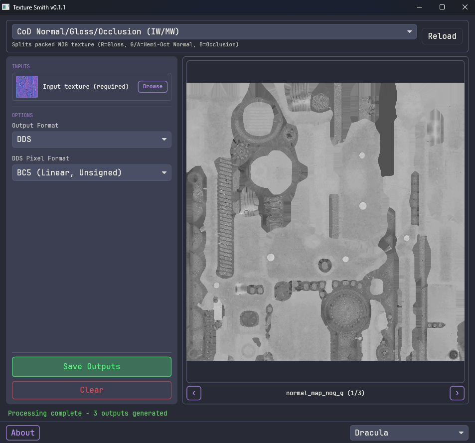

# Texture Smith

A tool for performing image operations on various packed/compressed textures!

Built with Rust and [Iced](https://github.com/iced-rs/iced)



## Features

- **Browse Button Interface**: Click Browse buttons to select texture maps for each slot
- **Real-time Preview**: See input textures and merged output in real-time
- **Customizable Settings**

## How to Use

1. **Launch the application**
2. **Select a shader from the dropdown**
2. **Load your texture files** using the Browse buttons:
3. **Watch the merged output**
4. **Save the merged output**:

## Texture Conversions

This provides GPU-accelerated texture processing using custom shaders. It supports a wide range of operations including:

- Channel splitting and extraction
- Normal map reconstruction (BC5, DXT5, hemi-octahedron formats)
- Fused texture separation (Call of Duty formats)
- Format conversions and inversions
- Multi-input texture merging

### Creating Custom Converters

Want to create your own texture processing shader? See the [Shader Guide](SHADER_GUIDE.md) for complete documentation on writing custom WGSL shaders.

## Building from Source

### Requirements

- Rust 1.88 or higher
- Windows (tested), Linux, or macOS

### Build Instructions

```bash
# Clone the repository
git clone https://github.com/echo000/texture_smith
cd image_merge

# Build in release mode
cargo build --release

# Run the application
cargo run --release
```

The compiled binary will be in `target/release/texture_smith.exe` (Windows)

## Configuration

Settings are automatically saved to:

| OS      | Path                                          |
|---------|-----------------------------------------------|
| Windows | `%appdata%\ImageBaker\config\settings.dat`           |

## Available Themes
There are multiple themes to select from, each with a unique colour palette.

## Contributing

Contributions are welcome! Please feel free to submit a Pull Request.
